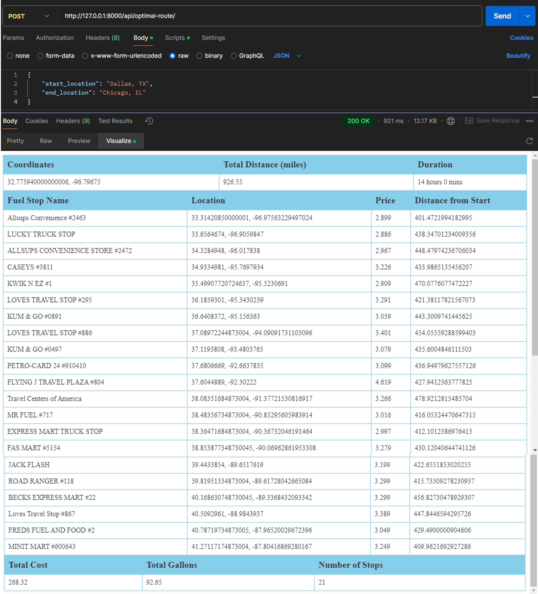
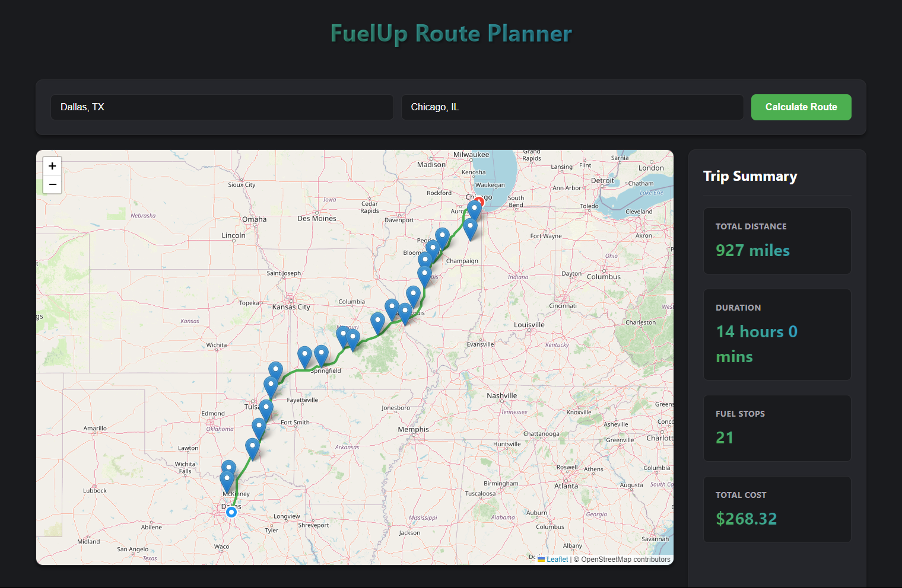

# fuelup

## Project Requirements

* API that takes inputs of start and finish location both within the USA
* Return a map of the route along with optimal location to fuel up along the route -- optimal mostly means cost effective based on fuel prices
* Assume the vehicle has a maximum range of 500 miles so multiple fuel ups might need to be displayed on the route
* Also returns the total money spent on fuel assuming the vehicle achieves 10 miles per gallon
* Use the attached file for a list of fuel prices 
* Find a free API yourself for the map and routing

## setup

```bash
git clone https://github.com/jiisanda/fuelup.git
cd fuelup
pip install -r requirements.txt
py manage.py makemigrations
py manage.py migrate
py manage.py populate_truckstop
py manage.py runserver
```

## API Endpoints

### Optimal Root endpoint

- URL : `/api/optimal-route`
- METHOD : `POST`
- Request Body : 
```json
{
    "start_location": "Dallas, TX",
    "end_location": "Chicago, IL"
}
```
- Response:
```json
{
  "route": {
    "coordinates": "",
    "total_distance_miles": "",
    "duration": ""
  },
  "fuel_stops": [],
  "summary": {
    "total_cost": "int",
    "total_gallons": "int"
    "number_of_stops": "int"
  }
}
```
- Visualized Response:



